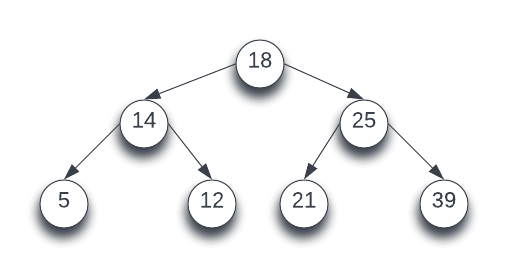

# AVL Trees

## Binary Search Trees
A binary search tree (BST) is a sorted variation of a binary tree. Child nodes on the left will have a smaller value than their parent and the ones of the right will have a greater value. Here is an example of a BST:



### Traversals
A binary search tree can be traversed with three different Depth-First traversals: inorder, preorder and postorder traversals. 


<b>Inorder Traversal</b>

```python
def inorder_traversal(root):
  if root:
    inorder_traversal(root.left)
    print(root.value)
    inorder_traversal(root.right)

inorder_traversal(root_node) # 5 14 16 18 21 25 39
```

<b>Preorder Traversal</b>

```python
def preorder_traversal(root):
  if root:
    print(root.value)
    preorder_traversal(root.left)
    preorder_traversal(root.right)

preorder_traversal(root_node) # 18 14 5 16 25 21 39
```

<b>Postorder Traversal</b>

```python
def postorder_traversal(root):
  if root:
    postorder_traversal(root.left)
    postorder_traversal(root.right)
    print(root.value)

postorder_traversal(root_node) # 5 16 14 21 39 25 18 
```

They can also be traversed using a Breadth-First Traversal:

```python
def breadth_first_traversal(root):
  # Create an queue with the root in it
  queue = [root]

  # loop while there are nodes in the queue
  while(len(queue)):
    node = queue.pop(0)
    print(node)

    # Add left child
    if node.left:
      queue.append(node.left)

    #Add right child
    if node.right:
      queue.append(node.right)

breadth_first_traversal(root_node) # 18 14 25 5 16 21 39
```


### Searching
Searching through a BST is like doing a binary search on a sorted array. We first check to see if the root is the value we are looking for. If the value is lower, we will go left and if it is higher we will go right.

```python
def search(root, value):
  # Base Case: No Root or Root is value
  # Either return the root or None
  if root is None or root.value == value: return root

  # Case 1: Value is lower
  if root.value > value: return search(root.left, value)

  # Case 2: Value is higher
  return search(root.right, value)

search(root_node, 18) # returns 18
search(root_node, 21) # returns 21
search(root_node, 27) # returns None
```

### Inserting
Inserting will follow the same pattern as searching, traversing to the left if its smaller and right if its larger until we find a an empty spot.

```python
def insert(root, value):
  # Base Case: Found Empty Position or No Root
  if root is None: return Node(value)

  # Case 1: The value already exists
  if root.value == value: return 'The node already exists'

  # Case 2: Value is greater than the root's value
  elif root.value < value: root.right = insert(root.right)

  # Case 2: Valie is less than the root's value
  else: root.left = insert(root.left)

  return root
```

The time complexity that we are trying to achieve for both search and insert is going to be O(logn), but if we insert these nodes in a bad order, we can end up with literally a linked list. This would bring insert and search times up to O(n). There is a way we can get around this, using self balancing binary search trees. There is more than one way to do this, but we will be going over AVL Trees.


## AVL Tree
